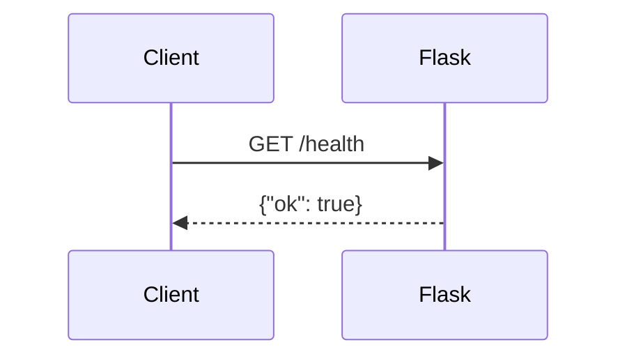
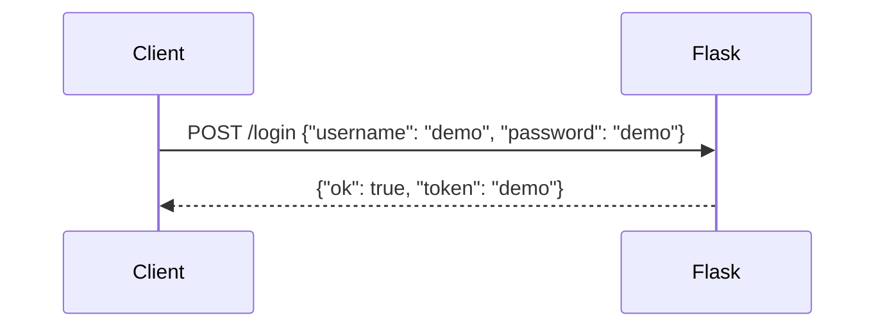
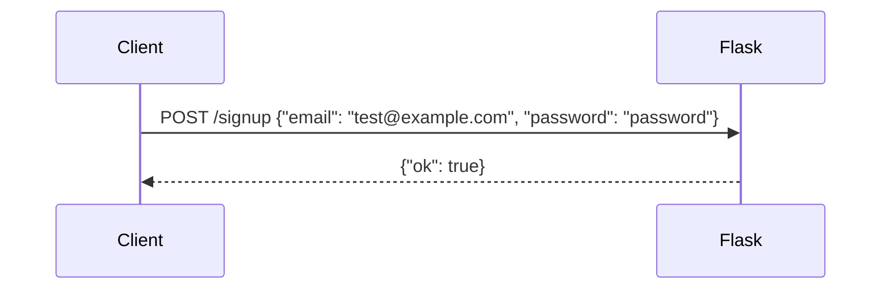

# Flask Authentication API

## Overview
This is a simple Flask application with health check and login endpoints.

## Endpoints
- **GET /health**: Returns the health status of the API.
- **POST /login**: Accepts a JSON body containing username and password.
- **POST /signup**: Accepts a JSON body containing email and password.

## Run
To run the application:
```
flask run
```

## Test
To run tests:
```
pytest
```

## Project Structure
```
my-saas/
├── app/
│   ├── auth.py
├── tests/
│   └── test_auth.py
└── README.md

## Sequence Diagrams

### GET /health


### POST /login


### POST /signup
